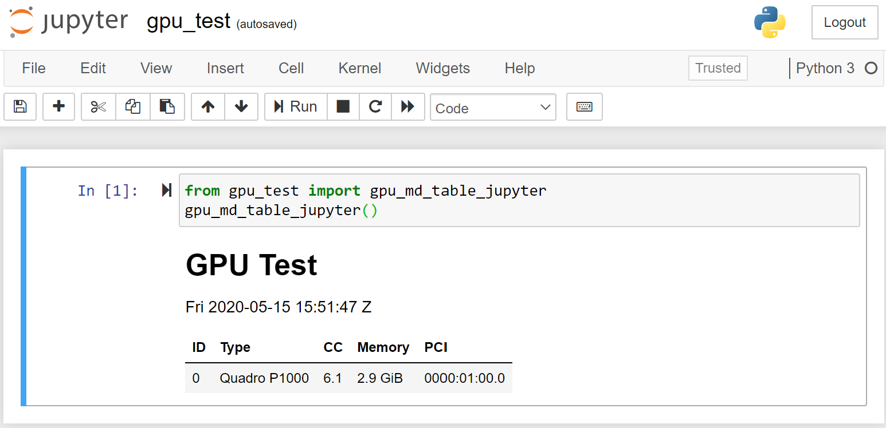

# About

Simple tests to prove that Python / TensorFlow have access to one or more GPUs

# Requirements

* Not running in a VM, WSL, or any environment without access to the GPU(s)
* Anaconda Python 3
* `conda create -n gpu python=3.6 anaconda tensorflow-gpu`

# Usage

## CLI

```text
$ python gpu_test_cli.py
# GPU Test

Fri 2020-05-15 15:18:23 Z

ID | Type | CC | Memory | PCI
:---|:---|:---|:---|:---
0 | Quadro P1000 | 6.1 | 2.9 GiB | 0000:01:00.0

```

## Code

### Boolean

```
>>> from gpu_test import have_gpu
>>> have_gpu()
True
```

### Count

```
>>> from gpu_test import count_gpus
>>> count_gpus()
1
```

### List

```
>>> from pprint import pprint
>>> from gpu_test import get_tf_gpus
>>> pprint(get_tf_gpus())
[{'compute capability': '6.1',
  'device': '0',
  'memory limit': '2.9 GiB',
  'name': 'Quadro P1000',
  'pci bus id': '0000:01:00.0'}]
```

### Markdown

```
>>> from gpu_test import gpu_md_table
>>> print(gpu_md_table())
# GPU Test

Fri 2020-05-15 15:45:38 Z

ID | Type | CC | Memory | PCI
:---|:---|:---|:---|:---
0 | Quadro P1000 | 6.1 | 2.9 GiB | 0000:01:00.0

```

### Jupyter

```
from gpu_test import gpu_md_table_jupyter
gpu_md_table_jupyter()
```



